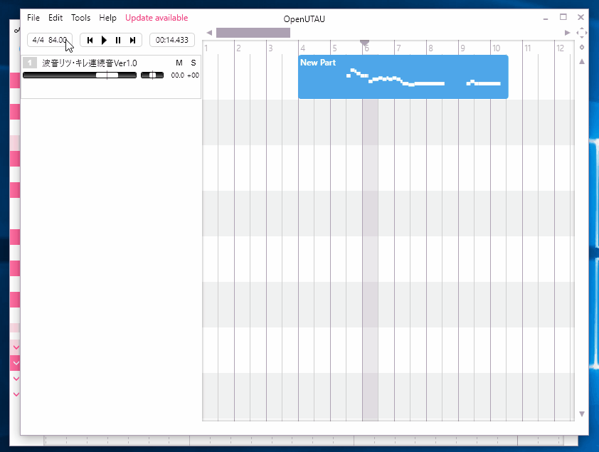

# OpenUtau
Current stage: Alpha

<a href="https://ci.appveyor.com/project/stakira/openutau/build/artifacts" target="_blank">Latest Build</a>

## Mission
The mission of OpenUtau is to create a open source editing environment for UTAU community, with modern user experience and intelligent phonological support. The ultimate goal is to make UTAU technology better and more popular.

## Preview

Fluent navigation using scroll wheel

Feature-Rich Midi Editor

Render and Playback

Redo Undo

## Scope
#### The scope of OpenUtau includes:
- Modern user experience.
- Compatibility with UTAU technologies.
- Intelligent VCV, CVVC an other voicebank sampling technique support.
- Internationalization, including UI translation and file system encoding support.
- Smooth preview/rendering experience.
- A easy to use plugin system.
- An efficient sample connecting engine (a.k.a. wavetool).
- A Windows version.

#### The scope of OpenUtau does not include:
- Resampling engines (a.k.a resampler).
- Full feature digital music workstation.
- OpenUtau does not strike for Vocaliod compatibility, other than limited features.

#### The scope of OpenUtau may include:
- An efficient resampling engine interface.
- Coorperate with other projects on resampling engine integration.
- A OS X version, but only after Windows version is mature.

# OpenUtau
開發進度：Alpha

## 專案目標
OpenUtau 的目標是為 UTAU 社群建立開源環境、現代的用戶介面及智慧語音學支援。此專案的終極目標是讓 UTAU 技術更臻完美且廣為流傳。

## 範圍
#### OpenUtau 專案範圍包括：
- 現代化使用者體驗
- 與現有 UTAU 技術的相容性
- 提供智慧化的 VCV、CVVC 及其它聲音資料庫之取樣方案
- 國際化，包含使用者介面翻譯及檔案系統編碼支援
- 流暢的預覽及渲染體驗
- 易於使用的插件系統
- 高效能樣本連接引擎（或稱 wavetool）
- Windows 版本

#### OpenUtau 專案範圍不包括：
- 重新取樣引擎（或稱 resampler）
- 全功能數位音樂工作站
- 專注於完整 VOCALOID 相容性

#### OpenUtau 專案範圍可能包括：
- 高效能重新採樣引擎輸入介面
- 與其它重新採樣引擎專案合作
- 完善 Windows 版本的開發後，開發 macOS 版本

# OpenUtau
开发进度: Alpha

## 项目目标
OpenUtau的目标，是为UTAU用户群体提供一个开源的编辑环境，包括现代的用户体验，和智能的语音学支持。该项目的最终目的，是提高和推广UTAU技术。

## 项目范围
#### OpenUtau将包含:
- 现代的用户体验
- 与UTAU技术的兼容性
- 对VCV、CVVC等音库采样方案的智能支持
- 国际化，包括多语言UI以及各文件系统编码支持
- 流畅的预览及合成体验
- 易用的插件系统
- 高效的采样拼接引擎(亦称wavtool)
- Windows版本

#### OpenUtau不包含:
- 重采样引擎(亦称resampler)
- 全功等的音频工作站软件
- 除有限的功能外，OpenUtau不追求和Vocaloid系列的兼容性

#### OpenUtau可能包含:
- 高效的重采样引擎接口
- 和其他重采样引擎项目合作
- Windows版本完善后，可能开发OS X版本

# OpenUtau (未確認の翻訳)
開発進捗状況: Alpha

## 目的
OpenUtauは現代的なユーザー体験と知能音声に基づき、音声合成領域でオープンソース的、自由な調音環境の構築を目的とする。最終的にはUTAU技術の更なる普及と発展を目指す。

#### OpenUtauには、以下の機能と優れを含む：
- 現代的なユーザー体験
- UTAU技術との互換性
- VCV、CVVCまた他の音声ベースのサンプリングへの支援
- 国際化（他言語化）への支援、UIの交換とファイルシステムへの支援を含む
- スムーズなプレビュー合成の体験
- 簡単で便利なプラグインシステム
- 効率的なサンプリング接続エンジン
- Windows版

#### ただしながら、これらのものは含まれない：
- リサンプリングエンジン
- 全能のデジタル・オーディオ・ワークステーション
- Vocaloidとの互換性は考量しない（一部の機能を除く）

#### なお、予定上以下の機能も実装されるが、場合によって実装されない可能性もある：
- 簡単で効率的なリサンプリングのインターフェース
- 他のプロジェクトのサンプリングエンジンとの組み合わせ
- OS X版
