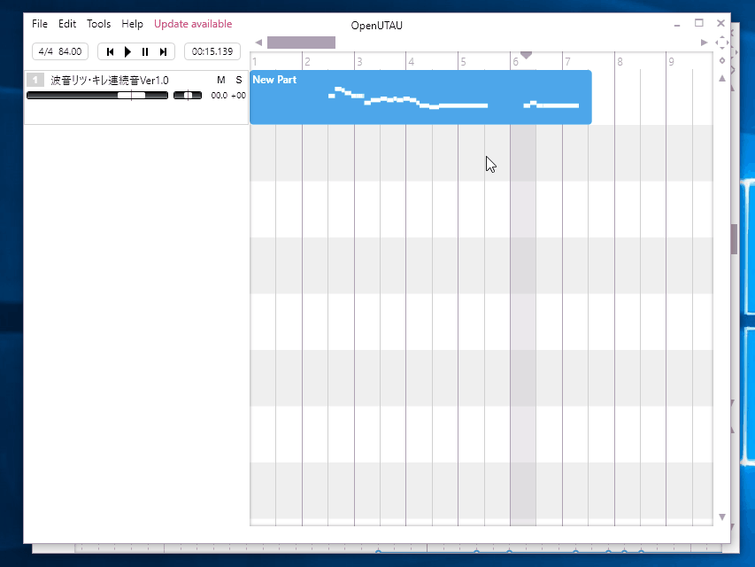
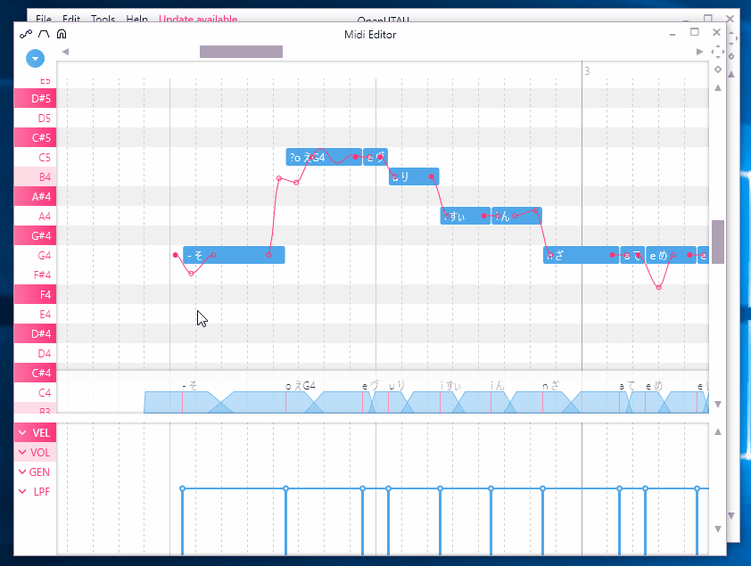
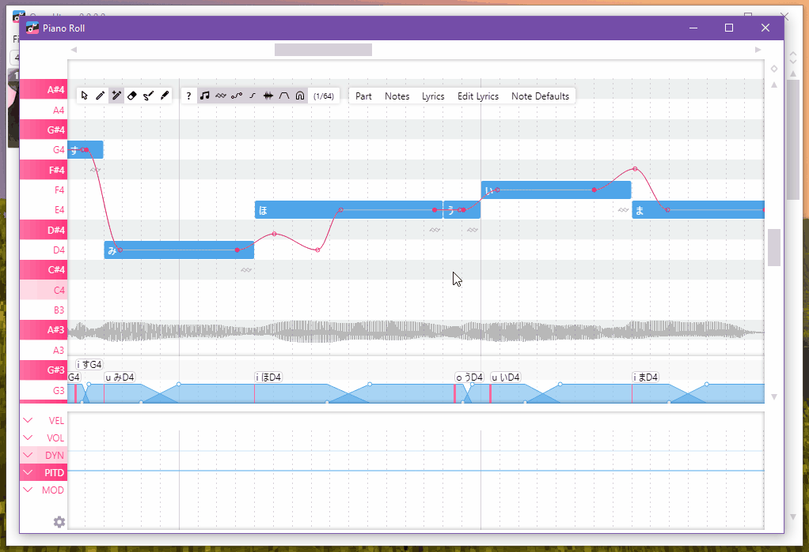
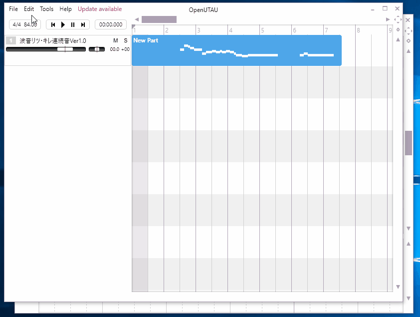

# OpenUtau

OpenUtau is a free, open-source editor made for the UTAU community.

## Getting started

 
 
 

It is **strongly recommended** that you read these Github wiki pages before using the software.
- [Getting-Started](https://github.com/stakira/OpenUtau/wiki/Getting-Started)
- [Resamplers](https://github.com/stakira/OpenUtau/wiki/Resamplers-and-Wavtools)
- [Phonemizers](https://github.com/stakira/OpenUtau/wiki/Phonemizers)
- [FAQ](https://github.com/stakira/OpenUtau/wiki/FAQ)

- [中文使用说明](https://opensynth.miraheze.org/wiki/OpenUTAU/%E4%BD%BF%E7%94%A8%E6%96%B9%E6%B3%95)

## How to contribute

Tried OpenUtau and not satisfied? Don't just walk away! You can help:
- Report issues on our [Discord server](https://discord.gg/UfpMnqMmEM) or Github.
- Suggest features on Discord or Github.
- Add or update translations for your language on Github.

Know how to code? Got an idea for an improvement? Don't keep it to yourself!
- Contribute fixes via pull requests.
- Check out the development roadmap on [Trello](https://trello.com/b/93ANoCIV/openutau) and discuss it on Discord.

## Plugin development

Want to contribute plugins to help other users? Check out our API documentation:
- [Editing Macros API Document](OpenUtau.Core/Editing/README.md)
- [Phonemizers API Document](OpenUtau.Core/Api/README.md)

## Main features

Navigate the interface naturally and fluently using the mouse and scroll wheel. Keyboard shortcuts are also available.

Easily create songs and covers using the feature-rich MIDI editor.

Create expressive vibratos with the easy-to-use vibrato editor.

Pre-rendering and built-in resamplers let you quickly preview your work.

See the [Getting-Started Wiki page](https://github.com/stakira/OpenUtau/wiki/Getting-Started) for more!

## All features
- Modern user experience.
- Easy navigation using the mouse and keyboard.
- Feature-rich MIDI editor.
  - Support for importing VSQX (Vocaloid 4) tracks.
- Selective backward compatibility with UTAU.
  - OpenUtau aims to solve problems with fewer steps. It is not designed to replicate UTAU features exactly.
- Extensible real-time phonetic editing.
  - Includes phonemizers for different phonetic systems (VCV, CVVC, Arpasing, etc.) in many different languages (English, Japanese, Chinese, Korean, Russian and more).
- Expressions replace the standard UTAU "flags" for tuning.
  - The built-in WORLDLINE-R resampler supports curve tuning, similar to many vocal synth editors.
- Internationalisation, including UI translation and file system encoding support.
  - Unlike UTAU, there is no need to change your system locale to use OpenUtau.
- Smooth preview/rendering experience.
  - Pre-rendering allows OpenUtau to render vocals before playback, saving time during editing and tuning.
- Supports ENUNU AI singers. See the  for more info.
- Easy-to-use plugin system.
- Versatile resampling engine interface.
  - Compatible with most UTAU resamplers.
- Runs on Windows (32/64 bit), macOS, and Linux.

### What it doesn't do
- While OpenUtau can do very minimal mixing, it will not replace your digital audio workstation of choice.
- OpenUtau does not aim for Vocaloid compatibility, except for some limited features.
